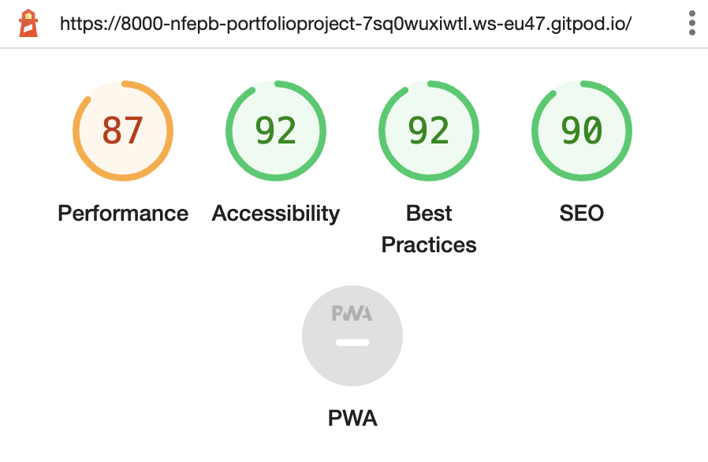

# Portfolio-Project-2-JavaScript: Rock, Paper, Scissors, Lizard, Spock

## Purpose

This Website was created as part of the Code Institute's Software Development (E-commerce Applications) curriculum. It was created using the knowledge gained from the modules HTML, CSS, User Experience Essentials, and JavaScript Essentials. A full list of technologies used can be found in the [technologies](#Technologies-Used) section of this document.

This Website allows users to play rounds of the game "Rock, Paper, Scissors, Lizard, Spock", which is based on the famously known game of "Rock, Paper, Scissors". Many decisions have been made as an outcome of a round or a game of "Rock, Paper, Scissors". The Website should be easy to use for any user.

The aim of the game is to win 5 rounds. After providing his/her/their name, the user can select the difficulty level. The difficulty level impacts how much time the user has during each round. Each round, the player has to select a sign. Based on the user choice sign and the computer choice, a winner is decided. In case the user and the computer select the same sign, it is a draw and no points are allocated.

## Table of Contents

- [User Experience (UX)| User Interface (UI)](#User-Experience-Design)
  - [The Strategy Plane](#The-Strategy-Plane)
    - [User stories](#User-Stories)
  - [The Scope Plane](#The-Scope-Plane)
  - [The Structure Plane](#The-Structure-Plane)
  - [The Skeleton Plane](#The-Skeleton-Plane)
    - [Wireframes](#Wireframes)
  - [The Surface Plane](#The-Surface-Plane)
    - [Design](#Design)
      - [Colour Scheme](#Colour-Scheme)
      - [Typography](#Typography)
      - [Imagery](#Imagery)

* [Features](#Features)
  - [Existing Features](#Existing-Features)
  - [Future Features](#Features-Left-to-Implement)

- [Technologies](#Technologies)

- [Testing](#Testing)

  - [Test Strategy](#Test-Strategy)
  - [Test Results](#Test-Results)
  - [Issues and Resolutions](#Issues-and-Resolutions-to-issues-found-during-testing)

- [Deployment](#Deployment)
  - [Project Creation](#Project-Creation)
  - [GitHub Pages](#Using-Github-Pages)
  - [Locally](Run-Locally)
- [Credits](#Credits)

  - [Content](#Content)
  - [Acknowledgements](#Acknowledgements)

  ***

## User Experience Design

### **The 5 Strategy Plane**

This website was created to showcase my knowledge of HTML, CSS & JavaScript. Its secundary objective is to provide users with a form of distraction through a game of "Rock, Paper, Scissors, Lizard, Spock" using my knowledge of HTML, CSS, and JavaScript. Based on a famous and widely known game, the game should be easy to understand, easy to interact with.

Website Goals:

- Showcase the knowledge I have acquired in HTML, CSS, JavaScript.
- Provide users with an interactive game to play that has clear Win / Lose Scenarios.
- Create an fun and interactive game that makes the user want to stay and play again.

#### User stories

As a user, I want to:

- understand the main purpose of the site.
- be able to visualise and interact with the website and content on any device.
- easily understand the rules.
- be able to start a game when I am ready.
- set a difficulty level to choose the challenge.
- know how much time I have left in the round.
- read the outcome of each round.
- know what is the current score of the game.
- be able to start a new game when the current game has come to an end.

As the website's owner, I want to:

- provide entertainment.
- make this game accessible to anyone.
- test my coding abilities through improvement of the script and features.

### **The Scope Plane**

Features delivered:

- Page Heading - A page heading that has a clear caption what the page is about.
- Interactive game of "Rock, Paper, Scissors, Lizard, Spock".
- Input for the user's name.
- Selection of difficulty levels.
- Game Instructions - Clear instructions on how to play and win the game.
- I'm Ready Button.
- Countdown timer.
- Outcome message for each round.
- Score Count.
- Final winner banner with final scores.
- Restart game button after a game.
- Footer Items - Rules of the game.

**Feature Importance/Effort**  
![Features]

### **The Structure Plane**

User Story:

> As a user, I want to easily understand the main purpose of the site.

Acceptance Criteria:

- Header displays text 'Studying is hard. Let us take a break and play:'
- Sub heading displayed with text 'Rock, Paper, Scissors, Lizard, Spock!'

Description: 
A page heading will be added that reads 'Studying is hard. Let us take a break and play:' with a tag line below it reading 'Rock, Paper, Scissors, Lizard, Spock!'. This will enable the users to immediately identify what the website is about as soon as they enter.

User Story:

> As a user, I want to be able to visualise and interact with the website and content on any device.

Acceptance Criteria:

- Website layout allows users to read the content across all sized devices and interact with it.

Description: 
A flex display will be used for the sign selection. It will allow better portability based on the device type used. Mobile first design will be used when coding the project and testing will be required to ensure the layout is clear on all devices. No elements should overlap their containers and all items should be responsive so that no elements are too large to display properly.

User Story:

> As a user, I want to easily understand the rules.

Acceptance Criteria:

- Game Instructions wille be provided upon entering the Website:
  - the Win/Lose criteria will be displayed.
- At the bottom of the page additional information will be provided about the game:
  - How to win the game.
  - How to lose the game.

Description: 
Information to be included:
A clear set of instructions about the game will be displayed to the user upon arrival on the website. The user will be able to chose the difficulty and launch the game. The user will know how to win or lose the game. 
An outcome message will describe the outcome of the round. 
Based on the outcome, the score will be incremented accordingly. 
After a score of "5" will be reached, a banner will display announcing the winner of the game and displaying the scores. 

User Story:

> As a user, I want to be able to start a game when I am ready.

Acceptance Criteria:

- User can initiate game when he/she/their choses.

Description: 
A button will be added to the welcome banner to allow the user to start a game.

User Story:

> As a user, I want to set a difficulty level to choose the challenge.

Acceptance Criteria:

- User can select the diffuclty to define how much of a challenge they need.

Description: 
Based on the difficulty level, the user defines how much time he/she/their has to select a sign each round. The timer countdown will launch as soon as the user will submit their choices and have provided their name.

User Story:

> As a user, I want to know how much time I have left in the round.

Acceptance Criteria:

- Display the countdown timer
- See how much time the user has to select a choice

Description: 
At the start of each round, the timer should reset based on the difficulty level. 
The timer should be easily visible and increment the computer score if it reaches 0. 

User Story:

> As a user, I want to read the outcome of each round.

Acceptance Criteria:

- Display who the winner of the round is
- Provide the reasoning of why the player won/lost the round

Description: 
After submitting their choice, the user can see what the computer has selected as a sign. 
Underneath the computer sign, an outcome message will display the logic of the battle and designate who the winner of the round is. 

User Story:

> As a user, I want to know what is the current score of the game.

Acceptance Criteria:

- User and Computer scores are displayed on Screen.

Description: 
A score section will be added to the page to show the user how many games they have won and how many games the computer has won. This score will only be displayed for the current session. Once the browser is refreshed, the score will reset.

User Story:

> As a user, I want be able to start a new game when the current game has come to an end.

Acceptance Criteria:

- User has a way to restart the game without refreshing the page.

Description: 
A button will be added to the banner upon completion of the game to allow the user to start a new game.

### **The Skeleton Plane**

#### Wireframes

 
 
 
 

### **The Surface Plane**

### Design

#### Colour Scheme

A pallette of colours were selected in order to bring sufficient contrast.

Background colour: A gradient to bottom right from Green to Blue [rgba(16, 99, 207, 0.5)](https://placehold.it/15/373638/000000?text=+)[rgba(56, 247, 151, 0.5)](https://placehold.it/15/373638/000000?text=+) 
Text colour and footer background: A shade of Blue [#34568B](https://placehold.it/15/FFFFFF/000000?text=+) 
Game Area background colour: A light grey [#E6E2EC](https://placehold.it/15/868686/000000?text=+) 
Footer text color: White [#FFFFFF](https://placehold.it/15/9E5656/000000?text=+) 
Banner background color: A shade of Yellow [#f5e780] 

#### Typography

The header and the body are using the [Fuzzy Bubbles](https://fonts.google.com/specimen/Fuzzy+Bubbles) font, while the text for the choice buttons is using [Gloria Hallelujah](https://fonts.google.com/specimen/Gloria+Hallelujah) 

#### Imagery

The logo displayed at the top of the page is a free icon. It can be found on the website of flaticons under the name [Mental Health free icon](https://www.flaticon.com/free-icon/mental-health_3588658?term=study%20break&page=1&position=1&page=1&position=1&related_id=3588658&origin=search). 

---

## Features

### Existing Features

- Heading and Sub-heading.
- User input banner.
- Button to launch the game.
- Game area with user input.
- Countdown timer based on difficulty.
- Outcome message.
- Win/Lose Scores.
- Banner announcing the winner.
- Button to re-start game on the winner banner.
- Footer - Information on how to win the game.

### Features Left to Implement

- Countdown run-out message.
- Outcome message when the player wants to play the first round without initially selecting a sign.

---

## Technologies

- [HTML](https://en.wikipedia.org/wiki/HTML)
  - This project uses HTML as the main language used to complete the structure of the Website.
- [CSS](https://en.wikipedia.org/wiki/CSS)
  - This project uses custom written CSS to style the Website.
- [JavaScript](https://en.wikipedia.org/wiki/JavaScript)
  - This project uses JavaScript for functionality through the Website, this includes the Rock, Paper, Scissors, Lizard, Spock, the onclick button functions, the timer, the difficulty levels.
- [Google Fonts](https://fonts.google.com/)
  - Google fonts are used throughout the project to import the _Fuzzy Bubbles_ and _Gloria Hallelujah_ fonts.
- [Font Awesome](https://fontawesome.com/)
  - Font Awesome icons are used to display the user choices and the selected computer choice for the signs Rock, Paper, Scissors, Lizard, and Spock.
- [GitHub](https://github.com/)
  - GitHub is the hosting site used to store the source code for the Website and [Git Pages](https://pages.github.com/) is used for the deployment of the live site.
- [Git](https://git-scm.com/)
  - Git is used as version control software to commit and push code to the GitHub repository where the source code is stored.
- [Google Chrome Developer Tools](https://developers.google.com/web/tools/chrome-devtools)
  - Google chromes built in developer tools are used to inspect page elements and help debug issues with the site layout and with the JavaScript logic.
- [Excel](https://www.microsoft.com/en-ie/microsoft-365/excel)
  - Excel was used to log the different tests and outcomes during testing phase.

---

## Testing

- Add excel here.  

### Test Strategy

#### **Summary**

Testing is required on Rock, Paper, Scissors, Lizard, Spock JavaScript game created for Milestone Project 2. All features and user stories documented in the README are to be tested.

HTML code must pass through the [W3C HTML Validator](https://validator.w3.org/).

CSS code must pass through the [W3C CSS Validator](https://jigsaw.w3.org/css-validator/).

JavaScript code must pass through the [JSHint Validator](https://jshint.com/).

#### **High Level Test Cases**

### Test Results

#### **Lighthouse**

This page was tested using the Lighthouse feature from the Chrome Browser, giving the following results:

* Desktop:
 
Full test results can be found [here](assets/test-results/ms2_test_results.xlsx) 
Please note these results are a .xlsx file and will require excel, google docs or compatiable program to open the file. 
All tests passed.
Testing of custom 404 page was performed to ensure you could navigate back to the home page without needing to use the browser buttons.

### Issues and Resolutions to issues found during testing

- JSHint did not recognize constants in the JavaScript code. Based on a question raised on [Stackoverflow](https://stackoverflow.com/questions/37247474/es6-in-jshint-jshintrc-has-esversion-but-still-getting-warning-using-atom), "/_jshint esversion: 6 _/" needed to be added on top of the script to disregard this known issue with ES6.
- JSHint warned of an error in the Switch statements. Breaks were omitted by design. The solution provided to disregard this error was provided on [Stackoverflow](https://stackoverflow.com/questions/22398251/jshint-throws-aexpected-a-break-statement-before-case/22398337) by adding a comment "/_ falls through _/" after each case block for the user selected sign.
- Error of testing timer
- Error of testing sign

---

## Deployment

### Project Creation

---

## Credits

### Code

The JavaScript Rock, Paper, Scissors, Lizard, Spock was created by following a published project on [Learnersbucket](https://learnersbucket.com/tutorials/js-projects/rock-paper-scissor-lizard-spock-game-in-javascript/). This was used as a source of inspiration and then heavily modified to fit the game design, including but not limited to: the timer countdown and the logic associated, the difficulty levels, the player input banner, the final outcome banner at the end of the game, the footer description with the rules.

### Acknowledgements

I would like to thank my friend Max for his support throughout this project, slack user Ronan_mentor for his advice and final JavaScript pointers on the last steps of this project.

---
